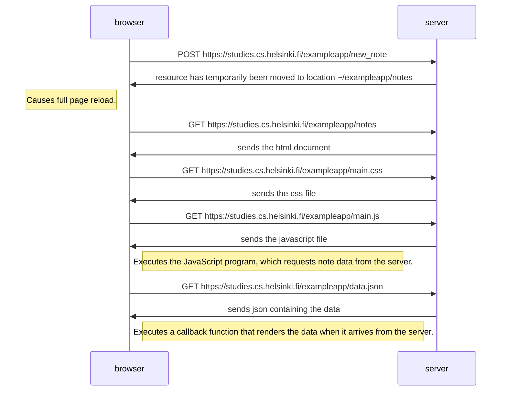

```mermaid
sequenceDiagram
    browser->>server:POST https://studies.cs.helsinki.fi/exampleapp/new_note
    server->>browser:resource has temporarily been moved to location ~/exampleapp/notes
    note left of browser: Causes full page reload.
    browser->>server:GET https://studies.cs.helsinki.fi/exampleapp/notes
    server->>browser:sends the html document
    browser->>server:GET https://studies.cs.helsinki.fi/exampleapp/main.css
    server->>browser:sends the css file
    browser->>server:GET https://studies.cs.helsinki.fi/exampleapp/main.js
    server->>browser:sends the javascript file
    note right of browser:Executes the JavaScript program, which requests note data from the server.
    browser->>server:GET https://studies.cs.helsinki.fi/exampleapp/data.json
    server->>browser:sends json containing the data
    note right of browser:Executes a callback function that renders the data when it arrives from the server.
```