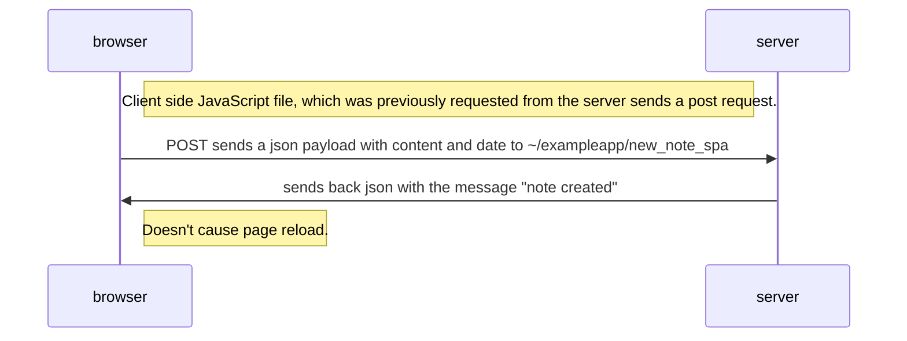

```mermaid
sequenceDiagram
    note right of browser: Client side JavaScript file, which was previously requested from the server sends a post request.
    browser->>server:POST sends a json payload with content and date to ~/exampleapp/new_note_spa 
    server->>browser:sends back json with the message "note created"
    note right of browser:Doesn't cause page reload.
```